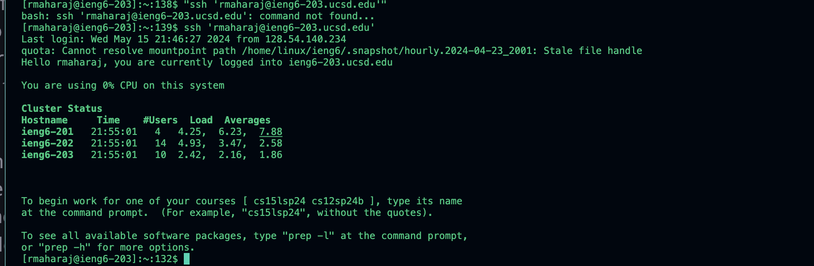

# CSE 15L Lab Report 4 - Vim 

## Step 4

<ssh><space><rmaharaj@ieng6-203.ucsd.edu>
<password><enter>

<ssh><space><rmaharaj@ieng6-203.ucsd.edu>

notes: letting me loggin to rmaharaj@ieng6-203.ucsd.edu, but not rmaharaj@ieng6.ucsd.edu

## Step 5

<git clone> <git@github.com:ucsd-cse15l-s24/lab7.git>
