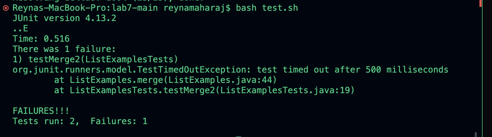

# CSE 15L Lab Report 4 - Vim 

## Step 4

ssh<space>rmaharaj@ieng6.ucsd.edu<enter>

## Step 5

git<space>clone<space>git@github.com:ucsd-cse15l-s24/lab7.git<enter>

## Step 6

keys pressed: bash<space>test.sh<enter>

## Step 7

Keys pressed: <delete>1 2 

## Step 8

bash<enter>tesh.sh

