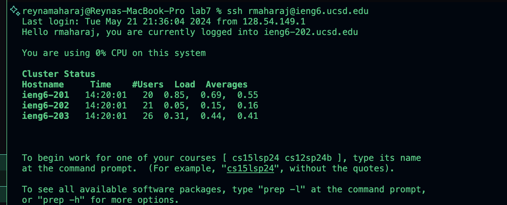
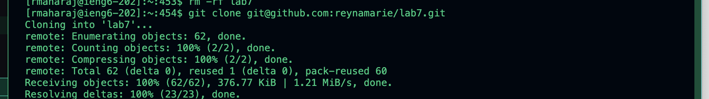
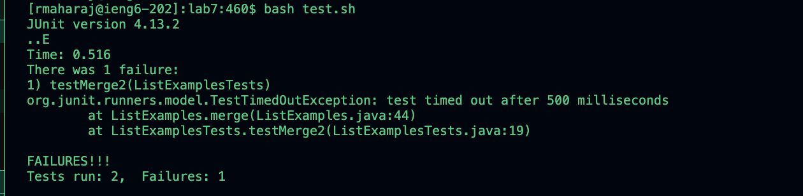
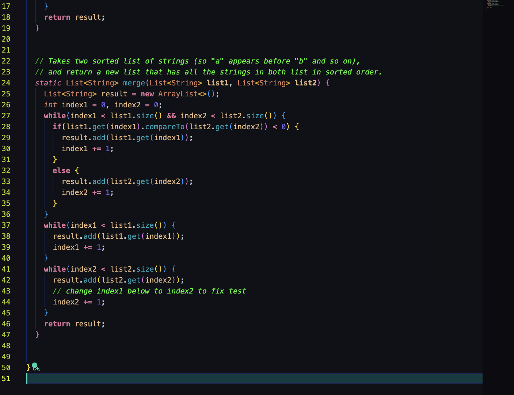
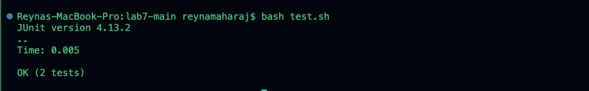

# CSE 15L Lab Report 4 - Vim 

## Step 4

Keys pressed: `ssh<space>rmaharaj@ieng6.ucsd.edu<enter>`
The  command  `ssh` allows me to log into the remote server `ieng6.ucsd.edu` using the username `rmaharaj` after pressing enter. Then, I pressed <enter> to log in and further execute commands there.

## Step 5

Keys pressed: `git<space>clone<space>git@github.com:ucsd-cse15l-s24/lab7.git<enter>`
This command clones the repository from GitHub into ieng6 server, which is the current directory.  The `<space>` key specifies that `<clone>` is an argument of `<git>`. The other `<space>` key  separates the previous commands from the repository URL so that it is recognized as an argument. The `<enter>` executes  the command, which produces the effect of me having access to edit and work on the files in lab7 due to this making a local copy.  

## Step 6

Keys pressed: `bash<space>test.sh<enter>`
The command bash<space>test.sh<enter> runs the bash script `test.sh`. The effect of this is to compile and run the tests. This shows that two tests ran and one of them failed. The `<space>` key  is used to separate the different parts of the command line.  The `<enter>` key is used to run the tests.

## Step 7

Keys pressed: `<delete>2`
This command fixes the bug in the `merge function` that was given to us in step 6 by changing the code to increment by `index2` instead of by `index1`. This effect was having the code increment correctly so that our test passed. 

## Step 8

Keys pressed: `bash<space>test.sh<enter>`
This command runs my tests again. This time the tests pass. The `<space>` key separates `bash` from its argument.  key The `<enter>` key executes the tests. 

## Step 9

Keys pressed: `git<space>add<space>.` `git<space>commit<space>-m<space>" hi there "` `git<space>push` 
The command `git<space>commit<space>-m<space>" commits my change to the repository, with my new message, hi there. The `git push` command updates via pushing the command line message to the local repository and then updates it to the remote repository, which will allow for these changes to be seen. The `<space>` keys separate all of the other parts of the command line. The `<enter>` key pressed executes the command. 
