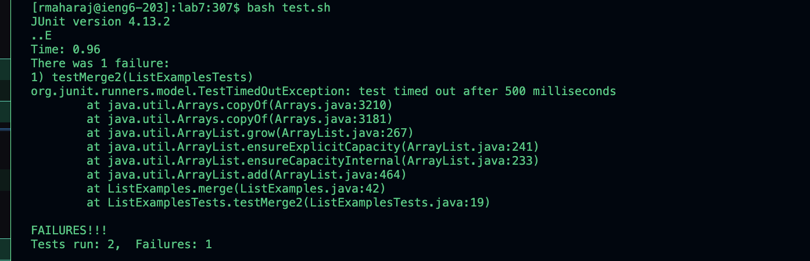

# CSE 15L Lab Report 4 - Vim 

## Step 4

Keys pressed: `ssh``<space>``rmaharaj@ieng6.ucsd.edu``<enter>`

## Step 5

Keys pressed: git`<space>`clone`<space>`git@github.com:ucsd-cse15l-s24/lab7.git`<enter>`

## Step 6

Keys pressed: bash<space>test.sh<enter>

## Step 7

Keys pressed: <delete>1 2 

## Step 8

Keys pressed: bash<enter>tesh.sh

